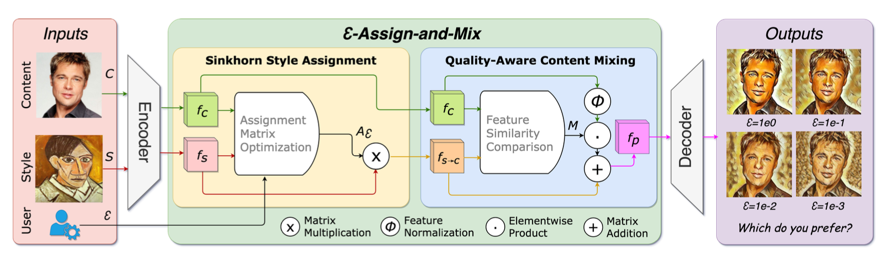
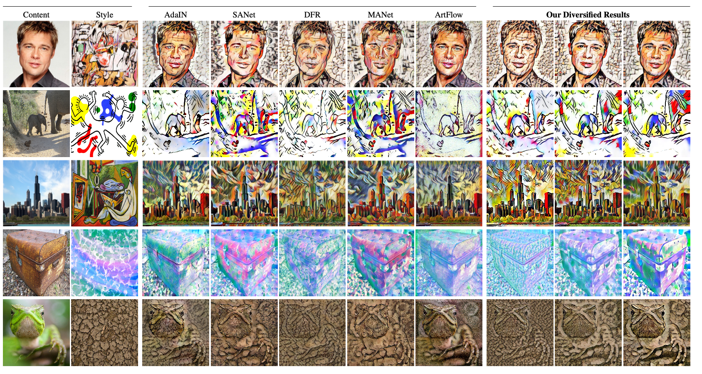

# eps-Assign-and-Mix
Official code release for AAAI 2023 paper User-controllable Arbitrary Style Transfer via Entropy Regularization



---

## Install

```
git clone https://github.com/cplusx/eps-Assign-and-Mix.git
pip install -r requirements.txt
```

## Dataset
Our model training use MSCOCO for content images and Painter By Number for style images.

Download MSCOCO
```
mkdir -p Dataset/cocostuff
cd Dataset/cocostuff
wget http://images.cocodataset.org/zips/train2017.zip
wget http://images.cocodataset.org/zips/val2017.zip
unzip train2017.zip
unzip val2017.zip
```

Download Painters By Number
```
mkdir -p Dataset/PBN
cd Dataset/PBN
pip install kaggle
kaggle competitions download -c painter-by-numbers -f train.zip
kaggle competitions download -c painter-by-numbers -f test.zip
unzip train.zip
unzip test.zip
```

---

### Sampling
See [epsAM_demo.ipynb](epsAM_demo.ipynb)



---

### Train
```
python train.py --eps 0
```